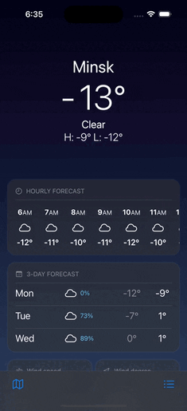
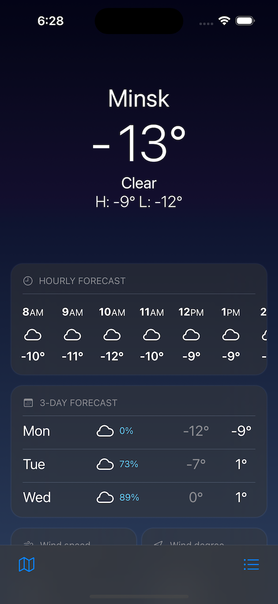
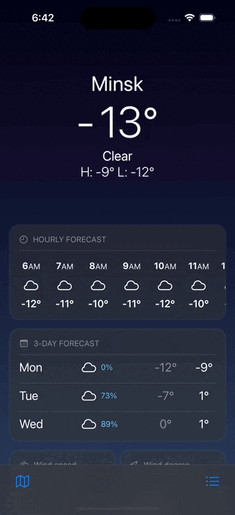
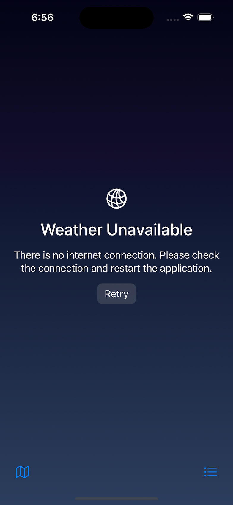
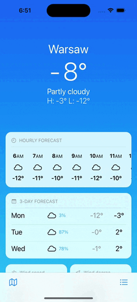
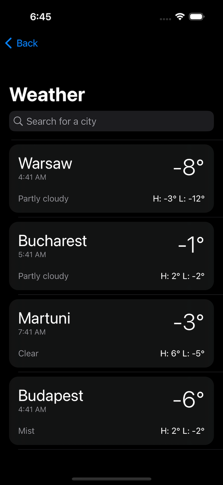

<div align="justify">

# Weather-SwiftUI Application




## About my project

Weather app for IOS 16.1 operating system, with the ability to view the weather, weather forecast, by day, 
weather forecast by hour in different cities around the world. 
With the ability to save your favorite cities in the phone memory and switch between them. 
The application uses the free <a href="https://www.weatherapi.com">WeatherAPI.com</a> API and is fully written using the SwiftUI framework. 

> The application is still under development, and it has flaws !

## Stack of technologies

- Swift(SwiftUI)
- MVVM
- Alamofire
- SOLID
- CocoaPods

# Application Features




## The app includes custom animations, and custom features

<dl>
  <li>
    Weather forecast for 3-5-10-14 days for absolutely any city.
  </li>
  <li>
    Hourly weather forecast for the next 24 hours.
  </li>
  <li>
   Ability to preview the weather window of the new city
  </li>
  <li>
    Additional weather information (wind strength, wind direction, chance of precipitation, temperature as you feel it, and e.t.c.)
  </li>
    <li>
    Beautiful and user - friendly interface with custom scrolling animation.
  </li>
</dl>

## Custom <a href="https://www.weatherapi.com">API</a> search for new cities
### The app is able to work and adjust to the color scheme of the device (Dark and white).
### Custom real-time error handling with the ability to send a second request.
### Ability to search and save new cities to favorites.


# Getting Started




## Conditions for running the application 

- A valid API key from <a href="https://www.weatherapi.com">WeatherAPI.com</a>.
- Device with MacOS Ventura, or later operating system.
- XCode Version 14.1, with a device or simulator running IOS 16.1.

## Installation

1. Clone this repository to your local MacOS machine.
2. Run the command, in the root folder of the application:
```
$ pod install
```
3. Open applications using the file Weather.xcworkspace.
4. Replace variable `API_KEY` with your valid API key from <a href="https://www.weatherapi.com">Weatherapi.com</a> in `DataFetcherService.swift`.
  
```swift
class DataFecherService {
    private let apiKey = "API_KEY" //example bc6f84dcf4ef4bb7a1b230849221212
```
</div>
